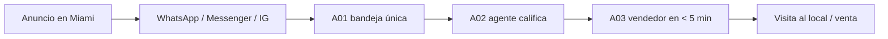

---
tags:
  - meta
  - client
  - nivel-2
client: alpha-cycles
status: onboarding
updated: 2026-09-21
---

# Alpha Cycles — operación Meta Ads

> Análisis inicial y plan de la primera campaña. Lo comercial está en [[clientes/alpha-cycles|clientes/alpha-cycles]]. Todo lo técnico del cliente (bandeja, agente, base) vive en el vault innova, `n8n/clients/alpha-cycles/`.

← Volver a [[meta/clientes/_index|Clientes]]

---

## Lo que sabemos hoy (21-09)

| Activo | Estado | Nota |
| --- | --- | --- |
| Sitio alphacyclesmiami.com | WordPress + plugin Motors, 86 motos publicadas | **Sin píxel de Meta.** Tiene Google Analytics. Tenemos application password de WordPress (proyecto de automatización) |
| Página de Facebook | Existe; admin Alejandro | No la pasaron todavía; pedida en el proyecto |
| Instagram @alphacyclemiami | Existe, acceso de lectura | Sin datos de seguidores |
| Business Manager | Existe (verificación de negocio en trámite para WhatsApp) | Falta agregarnos como socio |
| Cuenta publicitaria | Desconocida | Ver en el onboarding si pautan hoy |
| WhatsApp Cloud API | En trámite (A00) | Es el destino ideal de los anuncios |
| CRM | HubSpot con 8.973 contactos | Lista de clientes para excluir y, con el tiempo, audiencia similar |
| Bandeja única + agente (A01-A03) | Construidos, inactivos | **Deben estar en producción antes de lanzar** |

Claves y tokens: ver `ACCESOS-PUNTERO.md`.

---

## Embudo propuesto

Hasta que WhatsApp Cloud API esté activo, el destino de respaldo es un **formulario instantáneo** ("mayor intención" + una pregunta: "¿qué moto te interesa?") que n8n mete en la bandeja por webhook.

---

## Primera campaña propuesta

| | |
| --- | --- |
| Nombre | `[ALPHA] 2026-11 · Leads · Motos Miami` |
| Objetivo | Clientes potenciales · conversaciones iniciadas (o formulario, según A00) |
| Público | Miami-Dade + Broward, radio 15-30 millas, 25-55, amplio con audiencia Advantage+ · exclusión: clientes de HubSpot |
| Idiomas | Dos conjuntos o dos versiones de texto: español e inglés |
| Presupuesto | USD 50/día (mínimo EE. UU.); ideal 100/día · test 14 días |
| Creativos | 8-10 conceptos con material del cliente: modelos concretos con precio, financiación, trade-in, showroom, "te contestamos en minutos" |
| KPI | Costo por lead calificado < USD 30 · secundario: % de leads con moto identificada |
| Umbrales | Apagar anuncio a USD 60 sin lead tras 4-5 días; escalar 20% cada 2-3 días bajo USD 30 una semana |

Referencias de mercado 2026: CPM en EE. UU. ~USD 14; concesionarias, mínimo realista USD 1.500-3.000/mes.

---

## Análisis inicial

**A favor**
- Sistema de atención ya construido: el lead se contesta en segundos. Es la ventaja competitiva de la cuenta.
- Inventario real y variado: hay material y hay oferta.
- Cliente con presupuesto en dólares y contrato vigente.

**En contra**
- Nada de lo nuestro está en producción todavía (base de Neon pendiente).
- No sabemos si tienen cuenta publicitaria ni historial: puede ser una cuenta nueva.
- EE. UU.: la FTC advirtió en marzo de 2026 a 97 grupos de concesionarias por precios no transparentes. Cada precio anunciado tiene que ser el real, con cargos incluidos.

---

## Qué necesitamos del cliente

- [ ] Socio en el Business Manager (mismo trámite que WhatsApp e Instagram)
- [ ] Página principal de Facebook
- [ ] Cuenta publicitaria con tarjeta de Alpha y límite de gasto
- [ ] Verificación de negocio completa
- [ ] Material para creativos (guía de la plantilla de brief de creativos): fotos y videos de motos y local, condiciones de financiación, precios
- [ ] Vendedores y horarios de atención confirmados (A03)

## Qué hacemos nosotros antes

- [ ] Biblioteca de anuncios: ¿Alpha y sus 3-5 competidores de Miami pautan hoy? Qué anuncios llevan más de 60 días
- [ ] Píxel + Conversions API en el WordPress (con el application password)
- [ ] Audiencia de exclusión con la lista de HubSpot
- [ ] Webhook de formulario → A01, por si WhatsApp no llega a tiempo

---

## Historial

| Fecha | Qué pasó |
| --- | --- |
| 2026-09-21 | Alta en Ads. Análisis inicial y primera campaña propuesta. |
