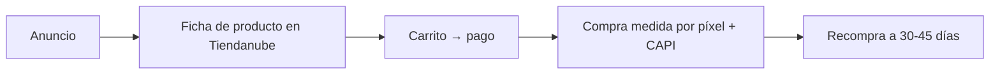

---
tags:
  - meta
  - client
  - nivel-2
client: altius-nutrition
status: onboarding
updated: 2026-09-21
---

# Altius Nutrition — operación Meta Ads

> Análisis inicial y plan de la primera campaña, **condicionada a que la tienda abra**. Lo comercial está en [[clientes/altius-nutrition|clientes/altius-nutrition]].

← Volver a [[meta/clientes/_index|Clientes]]

---

## Lo que sabemos hoy (21-09)

| Activo | Estado | Nota |
| --- | --- | --- |
| altiusnutrition.pro | **Tienda Tiendanube cerrada con contraseña** | El sitio Lovable de junio no es lo que está publicado; eligieron Tiendanube |
| Instagram / Facebook / TikTok @altiusnutrition.pro | Activos | Hay que ver cuánto contenido real tienen |
| Business Manager | A confirmar | |
| Píxel | No hay | Se resuelve con la integración nativa de Tiendanube (píxel + Conversions API) |
| Productos | 3: N+ PRIME CODE, FOCUS CODE, RECOVERY CODE (cápsulas) | Precios definidos en junio |

Claves y tokens: ver `ACCESOS-PUNTERO.md`.

---

## Embudo propuesto

---

## Primera campaña propuesta (cuando abra)

| | |
| --- | --- |
| Nombre | `[ALTIUS] 2026-11 · Ventas · N+ Prime` |
| Objetivo | Ventas · evento Compra (arrancar con Agregar al carrito si no llega a 50 compras/semana) |
| Público | Argentina, 25-45, amplio, 18+ · sin claims de peso |
| Presupuesto | USD 20-30/día · primer mes USD 600-900 |
| Creativos | 6-8 conceptos con su material: producto e ingredientes, testimonio de experiencia ("me rinde más el entrenamiento"), rutina de la mañana, comparación honesta, oferta de pack |
| KPI | ROAS > 2 al mes 2 (mes 1: 1,4-2,1 es lo normal en suplementos) · costo por compra < 30% del ticket |
| Umbrales | Apagar anuncio a ROAS < 1 tras 7 días con gasto; escalar 20% cada 2-3 días con ROAS > 2 una semana |
| Política | Cada texto revisado contra la norma de salud del 22-07-2026: nada de curar, tratar ni resultados en plazo; claims cognitivos con cuidado |

---

## Análisis inicial

**A favor**
- Producto con recompra y ticket que soporta pauta.
- Tiendanube resuelve píxel, Conversions API y medición sin desarrollo.
- Marca con identidad clara (negro, dorado, sobriedad) que ayuda a diferenciarse del ruido del rubro.

**En contra**
- **Tienda cerrada**: bloqueante total hasta que abra.
- Rubro regulado en Meta: rechazos y restricciones si el copy se pasa de la raya; los nombres de producto ya sugieren claims.
- Relación fría desde junio: hay que reactivar el contacto.

---

## Qué necesitamos del cliente

- [ ] Abrir la tienda (sacar la contraseña), precios y envíos cargados
- [ ] Portfolio empresarial y socio; cuenta publicitaria con su tarjeta
- [ ] Activar la integración de Meta desde el panel de Tiendanube
- [ ] Material: fotos de producto, 3-5 testimonios reales sin promesas médicas, ficha de ingredientes y registro
- [ ] Ticket, margen y costo de envío para fijar el CPA objetivo

## Qué hacemos nosotros antes

- [ ] Lista de claims permitidos y prohibidos para sus 3 productos, con la política de Meta al lado
- [ ] Biblioteca de anuncios: 5 marcas de suplementos en Argentina, qué corre hace más de 60 días
- [ ] Verificar la integración de Tiendanube el día que abra (Probar eventos)

---

## Historial

| Fecha | Qué pasó |
| --- | --- |
| 2026-09-21 | Alta en Ads. Análisis inicial; bloqueado por la tienda cerrada. |
