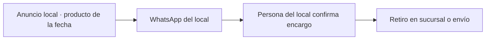

---
tags:
  - meta
  - client
  - nivel-2
client: don-blanco
status: onboarding
updated: 2026-09-21
---

# Don Blanco — operación Meta Ads

> Análisis inicial y plan de la primera campaña. Lo comercial está en [[clientes/don-blanco|clientes/don-blanco]]. La automatización administrativa (consolidados, vencimientos, cobros) vive en el vault innova, `n8n/clients/don-blanco/`.

← Volver a [[meta/clientes/_index|Clientes]]

---

## Lo que sabemos hoy (21-09)

| Activo | Estado | Nota |
| --- | --- | --- |
| Sitio donblanco.com.ar | WordPress (Elementor), con página de sucursales | **Sin píxel ni Analytics** |
| Instagram @pasteleriadonblanco | Activo | Contenido visual real: la materia prima de los anuncios |
| Facebook donblancopalermo | Activo | La página parece ser de la sucursal Palermo |
| Business Manager | A confirmar | Probablemente maneja alguien de redes; hay que preguntar |
| WhatsApp | A confirmar | Necesitamos el número del local que toma encargos |
| Sucursales | Palermo + planta Torcuato + otras (página "Sucursales" del sitio) | Un conjunto por zona |

Claves y tokens: ver `ACCESOS-PUNTERO.md`.

---

## Embudo propuesto

---

## Primera campaña propuesta: Día de la Madre

| | |
| --- | --- |
| Nombre | `[DON BLANCO] 2026-10 · Mensajes · Día de la Madre` |
| Objetivo | Interacción → WhatsApp · conversaciones iniciadas · mensaje precargado por producto ("Hola, quiero encargar la torta X para el Día de la Madre") |
| Público | Radio de 5-8 km por sucursal, 25-60, amplio · un conjunto por zona |
| Presupuesto | USD 10-15/día · 10-12 días (del 6 al 18 de octubre) · USD 120-180 |
| Creativos | 6-8 conceptos con su contenido de Instagram: producto estrella, box regalo, mesa dulce, detrás de escena de la planta, "encargá hasta el jueves" |
| KPI | Costo por conversación < USD 1,5 · encargos concretados / conversaciones > 30% |
| Umbrales | Apagar anuncio a USD 3 por conversación tras 3 días (la campaña es corta); mover presupuesto al conjunto con mejor costo al día 5 |
| Después | Repetir en diciembre (fiestas) y pasar a mensual con calendario del rubro |

Referencias de Argentina (agosto 2026): CPM ~ARS 2.870; con radio chico el CPM sube, la conversión también.

---

## Análisis inicial

**A favor**
- Relación caliente: proyecto entregado y cobrado.
- Rubro visual con contenido ya hecho.
- Fechas fuertes cada 2-3 meses: hay siempre un motivo para pautar.

**En contra**
- No sabemos quién maneja las redes ni si pautan: puede haber una agencia en el medio.
- El WhatsApp del local tiene que contestar en minutos en los días previos a la fecha.
- Lanzar el 6-8 de octubre exige cerrar el pitch esta semana.

---

## Qué necesitamos del cliente

- [ ] Quién administra la página y el Instagram; socio en su Portfolio
- [ ] Cuenta publicitaria con su tarjeta
- [ ] WhatsApp Business del local conectado a la página, y la persona que contesta
- [ ] Productos, precios y zonas de la fecha
- [ ] Permiso para usar su contenido de Instagram en los anuncios

## Qué hacemos nosotros antes

- [ ] Biblioteca de anuncios: Don Blanco y 3-5 pastelerías de zona norte y Palermo
- [ ] Mapa de sucursales con radios
- [ ] Mensajes precargados por producto

---

## Historial

| Fecha | Qué pasó |
| --- | --- |
| 2026-09-21 | Alta en Ads. Análisis inicial y campaña de Día de la Madre propuesta. |
