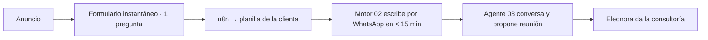

---
tags:
  - meta
  - client
  - nivel-2
client: hernando-ventas
status: onboarding
updated: 2026-09-21
---

# Hernando Ventas — operación Meta Ads

> Análisis inicial y plan de la primera campaña. Lo comercial está en [[clientes/hernando-ventas|clientes/hernando-ventas]]. El sistema de contacto por WhatsApp vive en el vault innova, `n8n/clients/hernando-ventas/`.

← Volver a [[meta/clientes/_index|Clientes]]

---

## Lo que sabemos hoy (21-09)

| Activo | Estado | Nota |
| --- | --- | --- |
| Sitio hernandoventas.com.ar | Activo | **Sin píxel ni Analytics.** No sabemos quién lo administra |
| Instagram @eleonorahernando | Activo | Es la marca: ella |
| Página de Facebook | A confirmar | Necesaria para pautar |
| Business Manager | A confirmar | Probablemente no existe |
| WhatsApp API | Número +54 9 11 2629-0293 vía Twilio | Verificación de Meta y plantilla en trámite (proyecto actual) |
| Motor de contacto (workflows 01-05) | Activos en el server de Demos | Lee su planilla y escribe solo; agente con su voz; agenda por mail hasta que fije horarios |
| Base de contactos | Planilla propia de la clienta | Lista para excluir de la pauta |

Claves y tokens: ver `ACCESOS-PUNTERO.md`.

---

## Embudo propuesto

Por qué formulario y no click-to-WhatsApp: el sistema que ya existe **sale a escribir**; con el formulario el lead entra al mismo circuito sin cambiar nada. Cuando el número esté verificado y ella fije horarios, se prueba click-to-WhatsApp como segundo conjunto.

---

## Primera campaña propuesta

| | |
| --- | --- |
| Nombre | `[HERNANDO] 2026-10 · Leads · Tiendas que no venden` |
| Objetivo | Clientes potenciales · formulario instantáneo "mayor intención" · pregunta: "¿Tenés tienda online activa?" (sí / la estoy armando / no) |
| Público | Argentina, 30-55, amplio · conjunto 2: intereses de comercio electrónico · exclusión: su base |
| Presupuesto | USD 10-20/día · test 14 días USD 200-300 |
| Creativos | 6-8 conceptos con su material: ella a cámara (problema, caso, oferta), pantallas de resultados de clientes, "24 años vendiendo online" |
| KPI | Costo por lead calificado (tienda activa) < USD 6 · reunión agendada < USD 30 |
| Umbrales | Apagar anuncio a USD 12 por lead tras 4-5 días; escalar 20% cada 2-3 días bajo USD 6 una semana |
| Fecha | Semana del 20-10-2026, cuando el agendado automático esté activo |

Referencias de Argentina (agosto 2026): CPM ~ARS 2.870, CPC ~ARS 129.

---

## Análisis inicial

**A favor**
- Persona real con historia: el creativo más barato y creíble de 2026.
- El seguimiento ya está automatizado: ningún lead se enfría.
- Público claro y fácil de describir para el sistema.

**En contra**
- Sin página de Facebook confirmada, sin píxel, sin Business Manager: el setup es desde cero.
- Ella no puede atender reuniones hasta mediados de octubre.
- Presupuesto chico: hay que ser prolijos con el umbral de aprendizaje (50 leads por semana no van a llegar; se optimiza igual, con paciencia).

---

## Qué necesitamos de la clienta

- [ ] Página de Facebook y Portfolio empresarial a su nombre; socio para Innova
- [ ] Cuenta publicitaria con su tarjeta
- [ ] Acceso al sitio (o quien lo administra) para el píxel
- [ ] Material: 3-5 videos cortos de ella, 2-3 casos con números, fotos
- [ ] Definición de lead válido y su disponibilidad para reuniones

## Qué hacemos nosotros antes

- [ ] Webhook del formulario de Meta → n8n → planilla (mismo formato que usa el workflow 01)
- [ ] Biblioteca de anuncios: consultores de e-commerce en Argentina, qué corre hace más de 60 días
- [ ] Píxel en el sitio apenas tengamos acceso

---

## Historial

| Fecha | Qué pasó |
| --- | --- |
| 2026-09-21 | Alta en Ads. Análisis inicial y primera campaña propuesta. |
