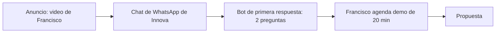

---
tags:
  - meta
  - client
  - interno
  - nivel-2
client: innova
status: pausado
updated: 2026-09-21
---

# Innova (interno) — operación Meta Ads

> Caso propio. Lo comercial está en [[clientes/innova|clientes/innova]]. Este README es el ejemplo de cómo queda el de un cliente cuando está completo.

← Volver a [[meta/clientes/_index|Clientes]]

---

## Cuenta

| Activo | ID / nombre | Dueño | Acceso de Innova |
| --- | --- | --- | --- |
| Portfolio empresarial | Innova Solutions (a crear o verificar) | Innova | Propietario |
| Cuenta publicitaria | act_… (a crear) | Innova | Propietario |
| Página de Facebook | Innova Solutions | Innova | Administrar |
| Instagram | @innovasolutions… | Innova | — |
| Píxel / conjunto de datos | a crear | Innova | Administrar |
| WhatsApp Business | +54 … (línea de Innova) | Innova | — |
| Dominio verificado | innovasolutionsai.io | — | ⬜ |

Claves y tokens: ver `ACCESOS-PUNTERO.md` (punteros, sin valores).

---

## Embudo

Quién atiende: Francisco, lunes a viernes 9 a 19. Primera respuesta automática en segundos (el propio bot de Innova, que además es la demo). Fuera de horario, el bot toma los datos y avisa por Telegram.

---

## KPI, umbrales y definición de lead válido

| KPI | Umbral | Válido si… |
| --- | --- | --- |
| Costo por conversación iniciada | < USD 4 | Negocio de servicios en AR, 2+ personas atendiendo, WhatsApp como canal principal |
| Secundario: conversaciones válidas / totales | > 40% | Se mide a mano en la primera semana |

Reglas de decisión: apagar anuncio a 2× umbral (USD 8) tras 4-5 días con gasto; escalar 20% cada 2-3 días si está bajo USD 4 una semana; si las válidas bajan del 40%, cambiar preguntas del bot y ángulo antes que audiencia.

---

## Campañas

| Campaña | Objetivo | Estado | Desde | Hasta | Bundle |
| --- | --- | --- | --- | --- | --- |
| 2026-10-agentes-ia-leads | Clientes potenciales → WhatsApp | planificada | 2026-10-05 (tentativo) | 2026-10-19 | [[meta/clientes/innova/campanas/2026-10-agentes-ia-leads/brief\|brief]] |

---

## Creativos: material disponible

- Demos grabables en pantalla (clínica, odontología, bodegón): sirven para el ángulo "cómo funciona".
- Francisco a cámara: hay que grabar (guía en `meta/templates/brief-creativos.md`, aplica a nosotros mismos).
- Testimonio: pedir a un cliente actual un audio o video de 30 s.
- Marca: logo y colores de Innova (verde/negro de VORA no; Innova tiene los suyos).

---

## Reportes

Sheet: a crear en el onboarding. Reporte de lunes: a Francisco (mail propio), como si fuera un cliente, para probar la plantilla y después el flujo n8n.

---

## Historial

| Fecha | Qué pasó |
| --- | --- |
| 2026-09-14 | Alta del caso propio. Bundle de campaña planificado. |
