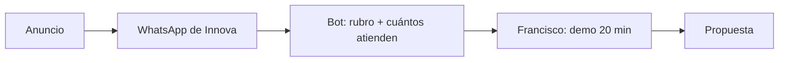

---
tags:
  - meta
  - campana
  - plan
  - nivel-3
client: innova
campaign: 2026-10-agentes-ia-leads
updated: 2026-09-14
---

# Plan — Innova · 2026-10 · agentes de IA · leads

> Ejemplo de plan completo. Nada se crea en Ads Manager hasta que Francisco lo confirme (acá, el cliente es él mismo, pero la regla es la misma).

---

## Objetivo y evento

| | |
| --- | --- |
| Objetivo de campaña | Clientes potenciales |
| Evento de optimización | Conversaciones iniciadas por WhatsApp |
| Destino | WhatsApp de Innova, mensaje precargado |

## Estructura

```
Campaña  [INNOVA] 2026-10 · Leads · Agente IA WhatsApp   (presupuesto de campaña: SÍ, USD 20/día)
├── Conjunto 1  Amplia AR 28-60 · Auto
│   ├── Anuncio  Problema · Video 9:16 · v1      (Francisco a cámara: "el lead que no contestás…")
│   ├── Anuncio  Problema · Imagen 4:5 · v1      (frase + captura de chat)
│   ├── Anuncio  Cómo funciona · Video 9:16 · v1 (demo grabada en pantalla, Clínica Vitalis)
│   ├── Anuncio  Cómo funciona · Imagen 4:5 · v1 (3 pasos)
│   ├── Anuncio  Oferta · Video 9:16 · v1        ("20 minutos, te lo muestro andando en tu rubro")
│   └── Anuncio  Oferta · Imagen 4:5 · v1
└── Conjunto 2  Intereses: pequeñas empresas + emprendimiento + administración · AR 28-60 · Auto
    └── (mismos 6 anuncios)
```

## Audiencias

| Conjunto | Tipo | Definición | Exclusiones |
| --- | --- | --- | --- |
| 1 | Amplia | Argentina, 28-60, viven en; audiencia Advantage+ activada | Empleados de Innova; clientes actuales (lista) |
| 2 | Intereses | Pequeñas y medianas empresas, emprendimiento, administración de empresas | Ídem |

## Presupuesto

| | |
| --- | --- |
| Diario (campaña) | USD 20 (≈ 7 × CPL esperado de USD 3) |
| Total del test | USD 280 en 14 días (más IVA) |
| Presupuesto de campaña o por conjunto | De campaña: los conjuntos son parecidos y queremos que Meta reparta |

## Creativos

| Ángulo | Formato | Pieza | Estado |
| --- | --- | --- | --- |
| Problema | Video 9:16 + 4:5 | Francisco a cámara, 25 s: "Cada consulta que no contestás en 5 minutos, la contesta otro" | ⬜ grabar |
| Problema | Imagen 4:5 + 9:16 | Captura de chat sin responder + frase | ⬜ diseñar |
| Cómo funciona | Video 9:16 + 4:5 | Demo Clínica Vitalis en pantalla, 30 s con subtítulos | ⬜ grabar pantalla |
| Cómo funciona | Imagen 4:5 + 9:16 | 3 pasos: escribe → el agente contesta y califica → vos ves el turno agendado | ⬜ diseñar |
| Oferta | Video 9:16 + 4:5 | "20 minutos por videollamada y lo ves andando en tu rubro. Sin costo." | ⬜ grabar |
| Oferta | Imagen 4:5 + 9:16 | La misma oferta en texto | ⬜ diseñar |

Textos: 3 textos principales × 3 títulos por anuncio (ver [[meta/clientes/innova/creativos/2026-10-problema-video-9x16|creativo de ejemplo]]).

## Medición

- [ ] WhatsApp Business de Innova conectado a la página (requisito para click-to-WhatsApp).
- [ ] Píxel + CAPI en el sitio (no se optimiza a eso, pero arranca a juntar audiencia para después).
- [ ] UTMs no aplican (destino WhatsApp); en cambio, el mensaje precargado identifica la campaña.
- [ ] Dónde se ve el lead: el bot registra cada conversación en el Sheet de Innova con rubro y cantidad de personas → de ahí sale "válido".

## Umbrales de decisión

| Situación | Acción |
| --- | --- |
| Anuncio a USD 8 o más por conversación tras 4-5 días con gasto | Apagar |
| Anuncio con USD 10 gastados y 0 conversaciones | Apagar |
| Conjunto bajo USD 4 durante 7 días | +20% cada 2-3 días |
| Conversaciones válidas bajo 40% | Cambiar preguntas del bot y ángulo antes que audiencia |
| Costo arriba de USD 4 las dos semanas completas | Retro y replanteo: oferta u público |

## Calendario

| Fecha | Hito |
| --- | --- |
| 2026-10-05 (dom) | Lanzamiento (domingo a la noche para que el lunes ya tenga datos) |
| 2026-10-09 | Primera lectura |
| 2026-10-12 | Fin de aprendizaje · primer reporte (a Francisco, como si fuera cliente) |
| 2026-10-19 | Fin del test · retro · decisión: seguir con USD 600/mes o replantear |

## Riesgos

- Cuenta publicitaria nueva: arrancar con USD 20/día es prudente; no subir la primera semana.
- Texto con "atributos personales": revisar cada texto contra [[meta/playbooks/politicas-y-rechazos|políticas]].
- Francisco no puede atender demos: el bot agenda igual, pero si se acumulan, bajar presupuesto antes que perder leads.

## Embudo


