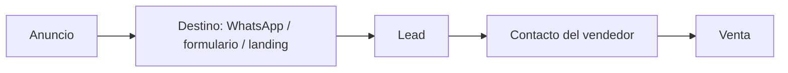

---
tags:
  - meta
  - client
  - nivel-2
client: <slug>
status: onboarding
updated: {{date:YYYY-MM-DD}}
---

# <Cliente> — operación Meta Ads

> Contexto operativo. Lo comercial está en `clientes/<slug>.md`.

← Volver a *Clientes* (`meta/clientes/_index`)

---

## Cuenta

| Activo | ID / nombre | Dueño | Acceso de Innova |
| --- | --- | --- | --- |
| Portfolio empresarial | … | Cliente | Socio |
| Cuenta publicitaria | act_… | Cliente | Administrar campañas |
| Página de Facebook | … | Cliente | Administrar |
| Instagram | @… | Cliente | — |
| Píxel / conjunto de datos | … | Cliente | Administrar |
| WhatsApp Business | +54 … | Cliente | — |
| Dominio verificado | … | — | ✅ / ⬜ |

Claves y tokens: ver `ACCESOS-PUNTERO.md` (punteros, sin valores).

---

## Embudo

Quién atiende los leads, en qué horario, en cuánto tiempo. Si hay bot o flujo n8n, link al bundle en el vault innova.

---

## KPI, umbrales y definición de lead válido

| KPI | Umbral | Válido si… |
| --- | --- | --- |
| CPL | < US$ … | … |

Reglas de decisión: apagar anuncio a 2× umbral tras 4-5 días; escalar 20% cada 2-3 días si está bajo el umbral una semana.

---

## Campañas

| Campaña | Objetivo | Estado | Desde | Hasta | Bundle |
| --- | --- | --- | --- | --- | --- |
| | | | | | `campanas/…` |

---

## Creativos: material disponible

Fotos, videos, testimonios, logo, colores. Dónde están (Drive). Qué falta pedir.

---

## Reportes

Sheet: link (solo lectura para el cliente). Mail de lunes a: …

---

## Historial

| Fecha | Qué pasó |
| --- | --- |
| {{date:YYYY-MM-DD}} | Alta |
