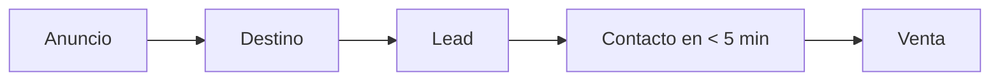

---
tags:
  - meta
  - campana
  - plan
  - nivel-3
client: <slug>
campaign: <YYYY-MM-slug>
updated: {{date:YYYY-MM-DD}}
---

# Plan — <Cliente> · <campaña>

> Cómo se arma. Nada se crea en Ads Manager hasta que Francisco confirma esto.
---

## Objetivo y evento

| | |
| --- | --- |
| Objetivo de campaña | Clientes potenciales / Ventas / Interacción |
| Evento de optimización | Lead / Compra / Conversación iniciada / … |
| Destino | WhatsApp / formulario instantáneo / landing … |

## Estructura

```
Campaña  [CLIENTE] YYYY-MM · Objetivo · Qué vende   (presupuesto de campaña: sí/no)
├── Conjunto 1  Amplia AR 25-55 · Auto
│   ├── Anuncio  Problema · Video 9:16 · v1
│   ├── Anuncio  Resultado · Imagen 4:5 · v1
│   └── Anuncio  Oferta · Video 4:5 · v1
└── Conjunto 2  Intereses (…) · Auto
    └── (mismos anuncios)
```

## Audiencias

| Conjunto | Tipo | Definición | Exclusiones |
| --- | --- | --- | --- |

## Presupuesto

| | |
| --- | --- |
| Diario por conjunto | US$ … (≈ 7 × CPL esperado) |
| Total del test | US$ … en … días |
| Presupuesto de campaña o por conjunto | … |

## Creativos

| Ángulo | Formato | Pieza | Estado |
| --- | --- | --- | --- |
| Problema | Video 9:16 + 4:5 | | ⬜ |
| Resultado | Imagen 4:5 + 9:16 | | ⬜ |
| Oferta | Video 4:5 + 9:16 | | ⬜ |

Textos: 3 textos principales × 3 títulos por anuncio.

## Medición

- [ ] Píxel + CAPI verificados en Probar eventos
- [ ] Evento de optimización disparando bien
- [ ] UTMs cargadas
- [ ] Dónde se ve el lead: …

## Umbrales de decisión

| Situación | Acción |
| --- | --- |
| Anuncio a 2× el umbral tras 4-5 días | Apagar |
| Anuncio con gasto 3× CPL esperado y 0 resultados | Apagar |
| Conjunto bajo el umbral 7 días | +20% cada 2-3 días |
| Costo por resultado arriba del umbral 2 semanas | Aviso al cliente + replanteo |

## Calendario

| Fecha | Hito |
| --- | --- |
| | Lanzamiento |
| +4 | Primera lectura |
| +7 | Fin de aprendizaje · primer reporte |
| +30 | Retro y reporte mensual |

## Riesgos

- Políticas: …
- Cuenta nueva sin historial: …

## Embudo


